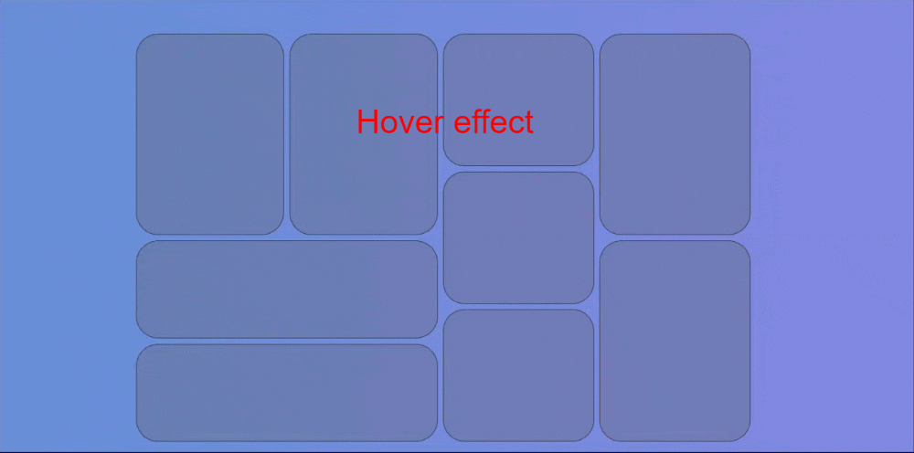

## Bento Grid Design Practice 01

2024/09/05

* 整體用flex去做排版
  * 先分割左右兩區域
  * 在劃分3個column區域
  * 在依照每個區域用flex分隔不同區塊
  

* Use flex for the overall layout.
    * First, divide it into left and right areas, then split it into 3 column areas.
    * Next, use flex in each area to divide different sections.
    * Apply responsive design (RWD) to complete the layout practice.

